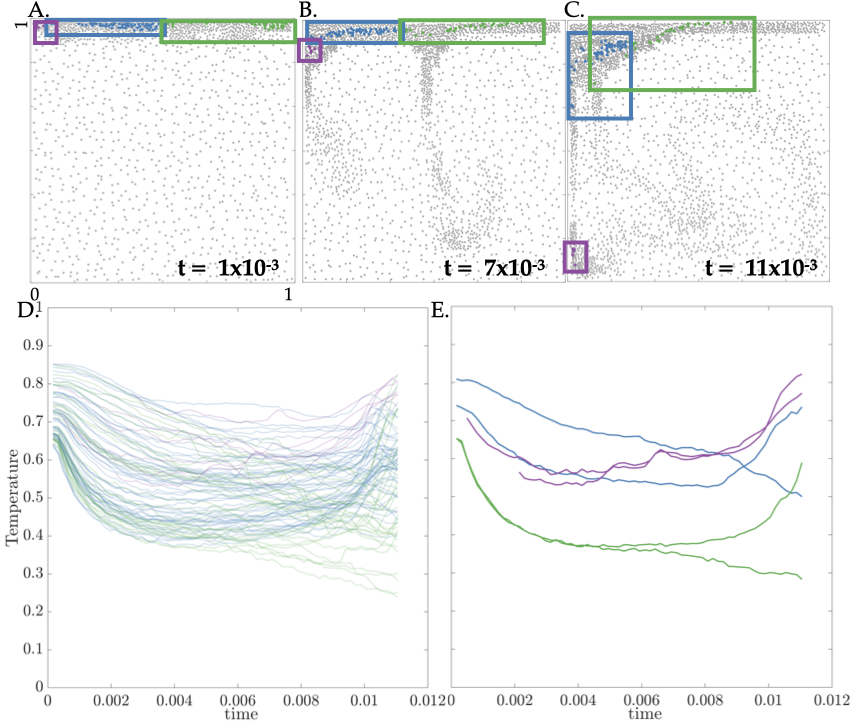

# Culha Fluid Thermodynamic Simulator

<a href="https://zenodo.org/badge/latestdoi/316609089"></a>

## Description

Repository for Culha et al., 2022 research on self-sustaining instability and its imprint on crystals: Biased witnesses: Crystal thermal records may give conflicting accounts of magma cooling
Project is current submitted to ESSOAr with the intention of submission to JGR. 


## Setup

Download the repository here.

## Run MELTs results

The repository is organized such that you can explore the MELTS simulation results separate from the Magma Dynamics simulator results. To access MELTs simulator, you need to download MELTs software package. Input of compositions and PT range is provided in the Manuscript in Table 1 or you can upload the provided <Input.melts> from this repository. The post processing script is unique for basalt and dacite. To get the density, viscosity, and crystallinity use the script: ''MELTS_analyzer_plotter_rhomucrys.m''

This corresponds to Fig. 1 in manuscript.
<p align="center">

</p>

## Run a Fortran simulation

The repo is set up to easily access the relevant data. However, when running a Fortran script, make sure to have the files in the MagmaDysimulator/Fortran library with the .f90 script. Each of the simulations I ran for the manuscript is in MagmaDysimulator/Experiments. For example, in terminal you can run this script below:

```
gfortran -O4 non-reactive_basalt.f90 umf4_f77wrapper.o libumfpack.a libamd.a libsuitesparseconfig.a -lm -lrt
```
To get a non-reactive basalt simulation results. 

The post-processing scripts are in MagmaDysimulator/post-processing-paper-Figs. You can access each output data in MagmaDysimulator/post-processing-paper-Figs/Experiment_Data.

The following folders in MagmaDysimulator/post-processing-paper-Figs/ correspond to scripts that generated the figures in the manuscript. 

### Fig 2
The script in Fig. 2 is used in Fig. 3-5. It is the temperature profile. Thus, the inputs for this script will change depending on which simulation you are running the post-process for. You can select the snapshot number, which is 101-300, that you would like to look at by indicating it here too. I also included a few other variables for you to visualize like density, velocity, etc. I also toggle the contours of crystals on and off to get an idea of their size. This script relies on the colormein script in the library folder. 
<p align="center">

</p>

### Fig 3
The script in Fig. 3 uses the data files in Experiment_Data. All you need to change is the name of the "crystaltracker" to match that of the experiment. I compile a crystaltracker data for each simulation using the crystaltracker.m file in library. You also need to change the temperature range that you would like to non-dimensionalize by if you would like it non-dimensional.
<p align="center">

</p>

### Fig 4A
To reproduce Fig. 4, run simulations at different control volume sizes. To access these simulation scripts, go to post-processing-paper-Figs/CV_testing. Similar to Fig. 1, I use Temp_snapshots.m to create snapshots of the simulations. I compile a crystal tracker data set for each simulation using crystaltracker.m file in library. Then I run DifferentDTs_CV.m to obtain the change in temperature. 

<p align="center">

</p>

### Fig 4B (not in manuscript)
To reproduce Fig. 4B that is not in the manuscript, I run simulations at different grid sizes. To access these simulation scripts, go to post-processing-paper-Figs/Grid_testing. Similar to Fig. 1, I use Temp_snapshots.m to create snapshots of the simulations. I compile a crystal tracker data set for each simulation using crystaltracker.m file in library. Then I run DifferentDTs_CV.m to obtain the change in temperature. 
<p align="center">

<figcaption align = "center"><b> Convergence study with increase in grid resolution.</b> We test 4 different grid resolutions. A-B is 111x111 cells; C-D is 211x211 cells; E-F is 311x311; and G-H is 411x411 cells. I shows the downwelling speeds. Blue line is the absolute average vertical speed that aligns with the downwelling. We average over the number of cells that have a negative vertical speed. Red line is the maximum absolute vertical speed that aligns with the downwelling. We use the same variability measurements along the blue line for the red line. J is the average change in temperature (as calculated for Fig.~3) for different grid resolutions.
</figcaption>
</p>
 

We conducted an analysis for grid resolution in figure above. With increase in grid size, we find an increase in time for the onset of the instability (Fig. above B,D, F, and H). This shows a convergence on the speed of convection. In Fig.~above I, we calculate the average negative speed within the domain (blue), which is predominantly the cells that make up the downwelling, as well as the maximum downwelling speed in the domain (red) at the final time step. We non-dimensionalize speed using stokes settling speed, w_0 as we do for the manuscript figures. We also show the variability about these speeds using vertical lines, which is same for the red and blue lines. The downwelling speed converges with increase in resolution. To optimize for the cost of these simulations, which can take on the order of days to, in some cases, multiple weeks, we use a resolution that fits 16 cells in a crystal. This corresponds to 211x211 for the example in Fig. above.  Fig.~aboveJ shows that average temperature change for the two different crystal populations that we test. We do not find that grid resolution has an important effect on thermal histories recorded by crystals.

### Fig 5 and 6
This script like before uses crystaltracker. Follow the same steps as Fig. 3.

<p align="center">

</p>
<p align="center">

</p>

### Fig 7
The scripts here follow Fig. 3-4 in steps. Crystal_movement.m plots the crystals in color for a simulation snapshot. Crystal_prof provides the profiles of those crystals. 
<p align="center">

</p>

### Fig 8 
These are just simulation snapshots in black and white. The steps follow Fig. 5. 
<p align="center">

</p>
